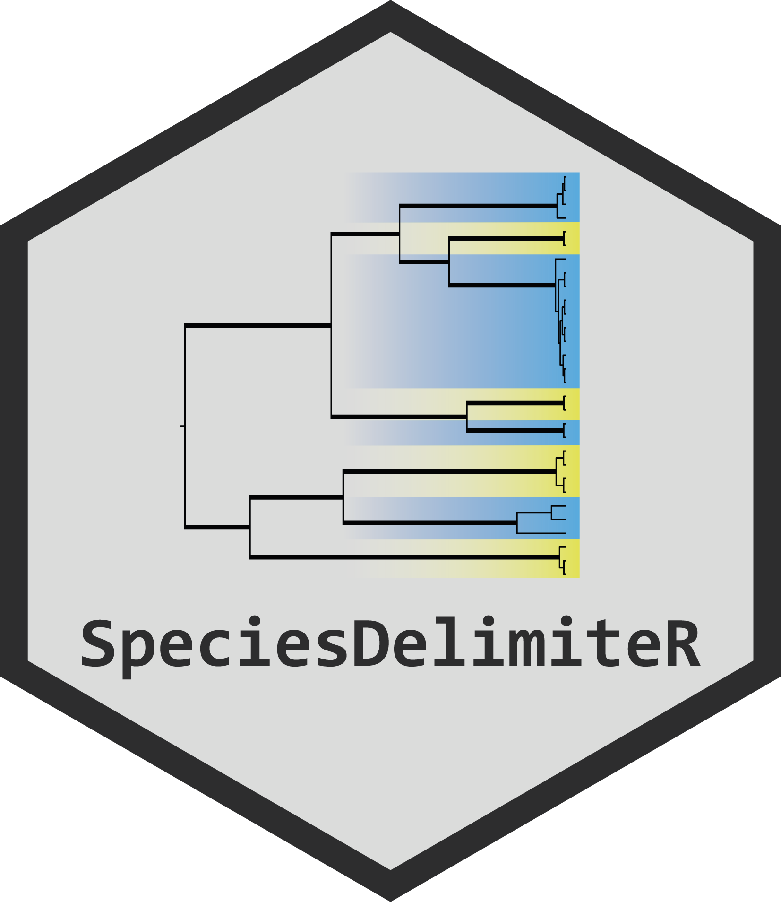

<!-- README.md is generated from README.Rmd. Please edit that file -->

```{r, include = FALSE}
knitr::opts_chunk$set(
  collapse = TRUE,
  comment = "#>",
  fig.path = "man/figures/README-",
  out.width = "100%"
)
```

# SpeciesDelimiteR

<!-- badges: start -->

<!-- badges: end -->

<div style="display: flex; justify-content: space-between; align-items: center;">
  <span style="flex: 1; max-width: 80%;"> 
    *SpeciesDelimiteR* is an R package designed to streamline species delimitation analyses. The package provides a toolkit for taxonomists to make informed decisions about species boundaries.
  </span>
  
</div>

## Features

- **Input preparation:** Functions to prepare data for widely used species delimitation algorithms, such as ASAP, GMYC, and bPTP.

- **Output parsing:** Functions for parsing the results of these algorithms.

- **Integrate results:** Combines the outputs of multiple delimitation methods, along with additional user-provided data (e.g., morphology, geography), into a single, cohesive dataframe.

- **Data visualization:** Visualizations to help users compare species delimitation results and choose on consensus species.

- **Reporting:** Summarizes key data points for easier integration into scientific papers.


## Installation

*SpeciesDelimiteR* is still on early development, and should not be used yet.
